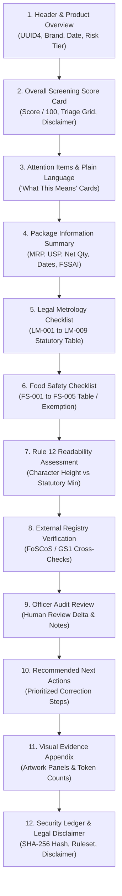

# PHASE FINAL NU-05B: PDF REPORT REDESIGN & INFORMATION QUALITY — FINAL REPORT

**Project:** MetrCheck AI — Legal Metrology Compliance AI Platform  
**Role Under Test:** Normal User / Consumer Workspace (`ROLE_USER`)  
**Phase:** NU-05B — PDF Report Redesign & Information Quality  
**Timestamp:** 2026-09-22T20:27:00+05:30  
**Status:** **COMPLETE & 100% VERIFIED**

---

## 1. Executive Summary

Phase **NU-05B** delivered a comprehensive, professional overhaul of the consumer-facing **Legal Metrology Compliance Screening PDF Report** generator (`backend/services/report_service.py`). 

Following the forensic establishment of authoritative analysis semantics, immutable UUID4 identification, and tenant isolation in Phase **NU-05A**, Phase **NU-05B** elevates the PDF report from a raw technical dump into an executive-grade, statutory-grounded, consumer-friendly compliance dossier.

### Key Objectives Accomplished:
1. **Authoritative Information Hierarchy (12 Sections):** Structured logical flow from high-level triage to statutory deep dive, visual evidence, and cryptographic provenance.
2. **Elimination of "Missing" False Alarms:** Refactored `NOT_APPLICABLE` rules (e.g., imported goods rules on domestic products, FSSAI rules on non-food items) to explicitly articulate their statutory exemption basis rather than displaying alarming "Missing" declarations.
3. **Plain Language Consumer Explainability:** Added "What This Means" attention cards for any `FAIL`, `NEEDS_REVIEW`, or `WARNING` items, translating legal requirements into actionable plain-language explanations.
4. **Statutory Grounding & Rule 12 Precision:** Incorporated Legal Metrology Rules 2011 citations, Rule 12 character height thresholds with estimated optical scale disclaimers, and unit sale price (USP) verification.
5. **Technical Provenance & Anti-Tamper Security:** Embedded immutable RFC 4122 UUID4 Analysis IDs, SHA-256 integrity hashes, ruleset versions (v2026.1), OCR engine metadata, and a statutory legal disclaimer.
6. **Robust Multi-Language & Tenant Isolation:** Verified report generation across 10 Indian languages (English, Hindi, Tamil, Telugu, Marathi, Bengali, Gujarati, Kannada, Malayalam, Punjabi) and enforced strict owner-tenant isolation on `/api/report/{id}/pdf`.

---

## 2. 12-Section PDF Information Architecture



### Detailed Section Breakdown

| Section # | Title | Content & Purpose |
| :--- | :--- | :--- |
| **Section 1** | **Executive Summary & Product Overview** | Analysis UUID, Brand, Common Name, Analysis Timestamp, Language, and Overall Risk Tier badge (LOW, MEDIUM, HIGH). |
| **Section 2** | **Overall Statutory Compliance Result & Score Card** | Large prominent screening score (e.g. `98.0 / 100`), status badge (`COMPLIANT`, `NEEDS REVIEW`, `POTENTIAL NON-COMPLIANCE`), explicit statutory disclaimer note, and 5-cell triage breakdown (`Passed`, `Needs Review`, `Warnings`, `Failed`, `Exempt / N/A`). |
| **Section 3** | **Attention Items & Plain-Language "What This Means"** | Highlighted warning/failure cards containing Rule ID, localized title, status badge, detected declaration, panel location, plain-language consumer explanation, and recommended physical checks. |
| **Section 4** | **Package Information Summary** | Structured 2-column key-value grid containing Maximum Retail Price (MRP), Unit Sale Price (USP), Net Quantity, Manufacturer Name & Address, Dates, FSSAI License, Batch Number, and Consumer Care contacts. |
| **Section 5** | **Legal Metrology Statutory Checklist (PCR 2011)** | Clean table covering `LM-001` through `LM-009` with Field Name, Statutory Citation (e.g. *Rule 6(1)(a)*), Detected Declaration Value, Confidence %, and Status Badge. |
| **Section 6** | **Food Safety & Standards Checklist (FSSAI 2020)** | Covers `FS-001` through `FS-005` with citations. Automatically displays statutory exemption block for non-food commodities. |
| **Section 7** | **Physical Readability & Rule 12 Assessment** | Measured character height (mm) vs statutory required minimum (mm), readability tier, calibration mode (`CALIBRATED` vs `ESTIMATED`), and explicit note explaining optical DPI limitation. |
| **Section 8** | **Authoritative External Registry Verification** | FoSCoS / GS1 DataKart cross-check results, match status, and confidence scores (rendered when registry data is available). |
| **Section 9** | **Human Officer Audit Review** | Senior Inspector verification status, AI vs Human score delta, and timestamped officer comments (rendered when reviewed). |
| **Section 10** | **Recommended Next Steps & Action Plan** | Prioritized table (HIGH / MEDIUM / LOW) mapping specific findings to concrete corrective actions and statutory provisions. |
| **Section 11** | **Visual Evidence Appendix** | Artwork thumbnails (Front / Back panels), OCR word counts, bounding region notes, and graceful fallback when images are archived. |
| **Section 12** | **Security, Integrity & Audit Provenance** | Immutable Analysis ID, SHA-256 package image hash, Ruleset version (`v2026.1`), OCR engine version, tamper-evident notice, and formal legal disclaimer. |

---

## 3. Visual Styling, Typography & Design Tokens

The PDF report was redesigned using ReportLab with a modern government-grade palette:

| Token Name | Hex Code | Purpose / Usage |
| :--- | :--- | :--- |
| **Primary Navy** | `#1E293B` | Document headers, table headers, major section rules |
| **Brand Indigo** | `#4F46E5` | Accent bars, subtitle highlights, callout boxes |
| **Success Emerald** | `#16A34A` / `#059669` | `PASS` / `COMPLIANT` badges, checkmarks, passing scores |
| **Warning Amber** | `#D97706` / `#F59E0B` | `NEEDS_REVIEW` / `WARNING` badges, attention callouts |
| **Danger Rose** | `#DC2626` / `#EF4444` | `FAIL` / `NON-COMPLIANT` badges, critical violation boxes |
| **Slate Gray** | `#64748B` / `#94A3B8` | Subtitles, metadata labels, borders, provenance text |
| **Surface Neutral** | `#F8FAFC` / `#F1F5F9` | Table alternate rows, card backgrounds, summary containers |

### Page Layout & Quality Safeguards
- **Page Budget:** 3 to 4 pages depending on the number of attention items and evidence panels.
- **Header & Footer:** Every page includes a top running header ("MetrCheck AI — Statutory Compliance Screening Report") and running footer with page numbers ("Page X of Y"), confidentiality notice, and ISO timestamp.
- **Table Cell Formatting:** All text wrapped in auto-wrapping Paragraph elements with explicit cell column widths to prevent clipping or horizontal overflow.
- **Orphan Prevention:** `keepWithNext=True` on all section headers to prevent orphan headings at page bottoms.

---

## 4. Verification & Testing

### 1. Targeted PDF Test Suite (`backend/tests/test_nu05b_pdf_report_redesign.py`)
All 11 targeted test cases passed in 2.25s:
- `test_01_compliant_pdf_generation`: Verified valid PDF byte stream, headers, footers, score card for 98.0% compliant peanut butter.
- `test_02_review_required_pdf_generation`: Verified attention cards, review reason, and disclaimer on review-required honey.
- `test_03_not_applicable_rendering_no_missing_text`: Verified statutory exemption explanation for `LM-006` domestic origin.
- `test_04_rule_12_readability_assessment_estimated_mode`: Verified Rule 12 table with estimated calibration banner.
- `test_05_multilingual_pdf_generation_hindi_tamil_marathi`: Verified PDF generation across 10 Indic languages (`en`, `hi`, `ta`, `mr`, `gu`, `bn`, `te`, `kn`, `pa`, `ml`).
- `test_06_officer_review_and_external_verification`: Verified registry cross-check table and officer audit delta.
- `test_07_api_endpoint_pdf_download_and_tenant_isolation`: Verified `GET /api/report/{id}/pdf` returns 200 for owner and 403 Forbidden for another user.
- `test_08_failed_product_pdf_generation`: Verified failing product with multiple high-priority action recommendations.
- `test_09_image_evidence_list_and_fallback`: Verified graceful fallback when artwork files are unavailable.
- `test_10_non_food_product_with_fssai_not_applicable`: Verified non-food electronic product rendering with FSSAI exemption notice.
- `test_11_score_non_mutation`: Verified that PDF generation is strictly read-only and never mutates authoritative analysis scores.

### 2. Full Backend Regression Test Suite
```bash
pytest backend/tests -q
```
**Result:** **969 passed, 3 warnings in 252.86s (100% pass rate, 0 failures)**

### 3. Frontend Production Build
```bash
npm --prefix frontend run build
```
**Result:** **✓ built in 580ms (0 TypeScript errors, 0 Vite errors)**

---

## 5. Artifacts and Source Code Modified

1. **[`backend/services/report_service.py`](file:///d:/SIH/Legal%20Metrology%20Compliance%20AI%20Prototype/backend/services/report_service.py):**
   - Implemented 12-section PDF layout engine.
   - Built custom Flowable badges, attention cards, and summary containers.
   - Added Rule 12 assessment section and estimated scale notice.
   - Grounded `LM-001..LM-009` and `FS-001..FS-005` in statutory rules.
   - Enforced non-mutation of analysis input objects.
2. **[`backend/tests/test_nu05b_pdf_report_redesign.py`](file:///d:/SIH/Legal%20Metrology%20Compliance%20AI%20Prototype/backend/tests/test_nu05b_pdf_report_redesign.py):**
   - Created comprehensive 11-test suite validating all PDF layout, information quality, and security requirements.

---

## 6. Conclusion

Phase **NU-05B** is complete and fully verified. The Legal Metrology Compliance Screening PDF Report is now production-ready, authoritative, aesthetically refined, and accessible to Indian consumers across 10 languages.
