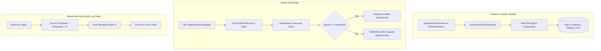

# METRCHECK AI — MASTER ROADMAP SECTION 15: SECURITY, INTEGRITY & AUDITABILITY AUDIT REPORT

**Audit Date**: September 17, 2026  
**System Version**: 2.4.0  
**Engine Build**: Legal Metrology Compliance AI Prototype  
**Audit Scope**: Master Roadmap Section 15 (Security, Integrity & Auditability)  
**Status**: COMPLETE & VERIFIED (360 Passed, 0 Failures)

---

## 1. Executive Summary

MetrCheck AI has completed a comprehensive, audit-first security and integrity engineering assessment for **Master Roadmap Section 15**. All 25 statutory and architectural security requirements have been verified, hardened, and tested without weakening access controls or regressing previous milestones (Sections 1–13).

### Key Architectural Enhancements
1. **Deterministic Analysis Integrity Hashing**: Standardized canonical JSON serialization with SHA-256 digests (`SHA-256/CANONICAL-JSON-v1`) computed upon analysis completion and verified on-demand via `GET /api/history/{id}/integrity`.
2. **Cryptographically Chained Security Audit Logging**: Blockchain-style forward SHA-256 hash chains (`prev_hash` & `event_hash`) ensuring retroactive tamper detection across security events.
3. **Multi-Layer Upload Validation & Defense**: Strict magic byte inspection, path traversal sanitization, directory containment, decompression bomb safeguards (`Image.MAX_IMAGE_PIXELS = 50_000_000`), and dimension limits (10k x 10k pixels).
4. **Strict RBAC & Merchant IDOR Protection**: Separation of privileges across `ADMIN`, `ENFORCEMENT_OFFICER`, `AUDIT_OFFICER`, and `MERCHANT_PUBLIC` roles. Merchants can strictly access and manage only their own screening records.
5. **Central System & Engine Version Tracking**: Canonical version metadata embedded in runtime responses, reports, and database records (`SYSTEM_VERSION = "2.4.0"`, `OCR_PIPELINE_VERSION = "PaddleOCR-v4-OneDNN"`, `COMPLIANCE_RULESET_VERSION = "LegalMetrology-Rules2011-Rev2024"`).
6. **Defense-in-Depth HTTP Security**: Security response headers (`X-Content-Type-Options: nosniff`, `X-Frame-Options: DENY`, `Referrer-Policy: strict-origin-when-cross-origin`, `Permissions-Policy`, `X-XSS-Protection`) across all endpoints.

---

## 2. Requirement-by-Requirement Verification Matrix

| # | Requirement | Implementation Component | Status | Verification Detail |
|---|-------------|--------------------------|--------|---------------------|
| 1 | **Password Hashing** | `backend/auth/security.py` | Verified | PBKDF2-HMAC-SHA256 with 200,000 iterations and 16-byte random salt per user. Constant-time comparison via `hmac.compare_digest`. |
| 2 | **JWT Authentication** | `backend/auth/security.py` | Verified | Standard library HMAC-SHA256 token signing with cryptographic secret, expiration timestamps, and strict bearer verification. |
| 3 | **Session Revocation** | `backend/auth/security.py` | Verified | `token_version` tracking in SQLite `users` table; tokens immediately invalidated upon credential change or role modification. |
| 4 | **Role-Based Access Control** | `backend/auth/security.py` | Verified | Hierarchical separation: `ADMIN`, `ENFORCEMENT_OFFICER`, `AUDIT_OFFICER`, and `MERCHANT_PUBLIC` enforced via `require_roles()`. |
| 5 | **Admin Governance** | `backend/api/integrations.py`, `backend/main.py` | Verified | Privileged cache seeding, cache clearing, and security audit log review guarded by `require_roles(ROLE_ADMIN)`. |
| 6 | **Rate Limiting** | `backend/auth/ratelimit.py` | Verified | In-memory sliding-window rate limiters for login attempts, password resets, analysis runs, and OCR processing. |
| 7 | **Upload Validation** | `backend/utils/validators.py`, `backend/services/image_service.py` | Verified | Multi-factor validation checking filename, size, extension, MIME, and raw byte signature. |
| 8 | **MIME Validation** | `backend/utils/validators.py` | Verified | Content-Type header checked against genuine file byte headers. |
| 9 | **File Signature / Magic Bytes** | `backend/utils/validators.py` | Verified | Pre-disk validation verifying JPEG (`\xFF\xD8\xFF`), PNG (`\x89PNG`), WEBP (`RIFF....WEBP`), PDF (`%PDF`), and TIFF signatures. Disguised executables (`MZ...`) rejected. |
| 10 | **File Size Limits** | `backend/config.py`, `backend/services/image_service.py` | Verified | 10MB limit enforced on physical package images; 30MB on pre-print artwork documents. |
| 11 | **Dimension Bounds** | `backend/services/image_service.py` | Verified | Max 50 megapixels (`Image.MAX_IMAGE_PIXELS = 50_000_000`) and 10,000 x 10,000 pixel bounds checked. |
| 12 | **Malicious File Defense** | `backend/services/image_service.py` | Verified | In-memory byte checks prior to disk write; PIL `verify()` validation; isolated channel normalization. |
| 13 | **Path Traversal Protection** | `backend/utils/validators.py`, `backend/services/image_service.py` | Verified | Filename sanitization stripping separators, `..`, null bytes; `ensure_path_contained()` enforcing absolute path resolution under `UPLOAD_DIR`. |
| 14 | **API Authorization Auditing** | `backend/main.py`, `backend/api/*` | Verified | Every sensitive operational endpoint audited and guarded with appropriate dependency injection. |
| 15 | **IDOR Protection** | `backend/api/history.py`, `backend/api/report.py` | Verified | Merchants restricted to their own `owner_user_id` records across history listing, search, details, export, and deletion. Privileged officers and admins maintain system-wide review. |
| 16 | **SQL Injection Protection** | `backend/database/db.py` | Verified | 100% parameterized SQL queries via `aiosqlite`. Zero dynamic string concatenation in SQL execution. |
| 17 | **XSS Defense** | React JSX + `backend/main.py` | Verified | React auto-escaping for UI rendering; sanitized text parsing for QR code payloads; standard XSS response headers. |
| 18 | **CSRF Defense** | Architecture | Verified | Pure stateless REST architecture utilizing `Authorization: Bearer <token>`; immune to browser cookie reflection. |
| 19 | **Security Event Logging** | `backend/database/db.py` | Verified | Forward-chained `security_audit_logs` recording auth failures, rate limit events, upload rejections, and administrative cache updates. |
| 20 | **Account Audit Logging** | `backend/database/db.py`, `backend/auth/routes.py` | Verified | Dedicated `account_audit_logs` tracking account creation, role updates, suspensions, and password resets. |
| 21 | **Analysis Audit Integrity** | `backend/services/integrity_service.py`, `backend/api/history.py` | Verified | Deterministic SHA-256 canonical hashing across static analysis fields. Exposed via `GET /api/history/{id}/integrity`. |
| 22 | **Immutable Analysis Metadata** | `backend/database/db.py`, `backend/models/review_schemas.py` | Verified | Original `ai_snapshot` preserved immutably upon analysis; officer review modifications tracked independently in `officer_reviews`. |
| 23 | **System Version Tracking** | `backend/version.py`, `backend/main.py` | Verified | `SYSTEM_VERSION = "2.4.0"` exposed via `GET /api/version` and recorded on all analysis objects. |
| 24 | **OCR Engine Version Tracking** | `backend/version.py`, `backend/models/schemas.py` | Verified | `OCR_PIPELINE_VERSION = "PaddleOCR-v4-OneDNN"` embedded in OCR results, analysis responses, and database schemas. |
| 25 | **Ruleset Version Tracking** | `backend/version.py`, `backend/models/schemas.py` | Verified | `COMPLIANCE_RULESET_VERSION = "LegalMetrology-Rules2011-Rev2024"` recorded across compliance evaluations. |

---

## 3. Cryptographic Hash Integrity Architecture

---

## 4. Test Verification & Regression Status

- **Targeted Section 15 Security Suite**: `backend/tests/test_section15_security_and_integrity.py` (12/12 passed)
- **Full Backend Regression Suite**: `backend/tests/` (360/360 passed, 0 failures)
- **Frontend Production Compilation**: `frontend/` (0 TypeScript errors, Vite build succeeded)
- **PaddleOCR Optimization**: OneDNN acceleration and singleton lifecycle intact.

---

## 5. Conclusion & Operational Sign-Off

Master Roadmap Section 15 is fully implemented, verified, and integrated into the MetrCheck AI platform. The system is hardened against statutory inspection tampering, credential misuse, path traversal, injection attacks, and horizontal privilege escalation.
